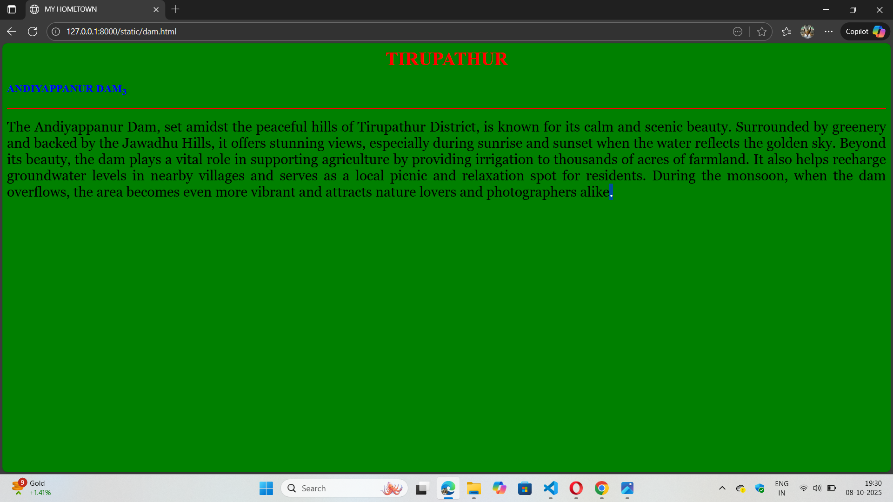

# Ex04 Places Around Me
## Date: 08.10.2025

## AIM
To develop a website to display details about the places around my house.

## DESIGN STEPS

### STEP 1
Create a Django admin interface.

### STEP 2
Download your city map from Google.

### STEP 3
Using ```<map>``` tag name the map.

### STEP 4
Create clickable regions in the image using ```<area>``` tag.

### STEP 5
Write HTML programs for all the regions identified.

### STEP 6
Execute the programs and publish them.

## CODE
```
map.html


<html>
    <head>
        <title>MY HOMETOWN</title>
    </head>
    <body bgcolor="pink>
        <h1 align="center">
        <font color="red"><b>TIRUPATHUR</b></font> 
        </h1>  
        <h3 align="center">
            <font color="blue"><b>PRADEEPA B (25017224)</b></font>
        </h3>
        <center>
            

<map name="image-map">
    <area target="" alt="Raja Rani Residency" title="Raja Rani Residency" href="residency.html" coords="631,351,830,418" shape="rect">
    <area target="" alt="Jalagamparai falls" title="Jalagamparai falls" href="waterfalls.html" coords="948,48,1191,94,1189,-1" shape="poly">
    <area target="" alt="Andiyappanur dam" title="Andiyappanur dam" href="dam.html" coords="1783,229,108" shape="circle">
    <area target="" alt="Home" title="Home" href="home.html" coords="749,203,728,262,905,259,888,212,749,204,910,259" shape="poly">
    <area target="" alt="Temple" title="Temple" href="temple.html" coords="542,313,517,356,763,323,719,291,632,276" shape="poly">
</map>
        </center>
    </body>
</html>

residency.html

<html>
    <head>
        <title>MY HOMETOWN</title>
    </head>
    <body bgcolor="yellow">
        <h1 align="center">
            <font color="red"><b>TIRUPATHUR</b></font>
        </h1>
        <h3 align="centre">
            <font color="blue"><b>RAJA RANI RESIDENCY<sub>1</sub></b></font>
        </h3>
        <hr size="3" color="red">
        <p align="justify">
            <font face="Georgia" size="5">
               Raja Rani Residency is a budget-friendly, 3-star hotel in Tirupattur, Tirupathur, popular for its location, on-site restaurant, and good value. 
               Guests often highlight the cleanliness and comfort of the rooms and the welcoming atmosphere.
               The hotel offers amenities like free Wi-Fi, complimentary breakfast, laundry service, and a 24-hour reception, with positive remarks for its friendly management and convenient check-in/out process.  
            </font>
        </p>
    </body>
</html>

dam.html

<html>
    <head>
        <title>MY HOMETOWN</title>
    </head>
    <body bgcolor="green">
        <h1 align="center">
            <font color="red"><b>TIRUPATHUR</b></font>
        </h1>
        <h3 align="centre">
            <font color="blue"><b>ANDIYAPPANUR DAM<sub>3</sub></b></font>
        </h3>
        <hr size="3" color="red">
        <p align="justify">
            <font face="Georgia" size="5">
                 The Andiyappanur Dam, set amidst the peaceful hills of Tirupathur District, is known for its calm and scenic beauty.
                 Surrounded by greenery and backed by the Jawadhu Hills, it offers stunning views, especially during sunrise and sunset when the water reflects the golden sky. 
                 Beyond its beauty, the dam plays a vital role in supporting agriculture by providing irrigation to thousands of acres of farmland. 
                 It also helps recharge groundwater levels in nearby villages and serves as a local picnic and relaxation spot for residents.
                 During the monsoon, when the dam overflows, the area becomes even more vibrant and attracts nature lovers and photographers alike.
            </font>
        </p>
    </body>
</html>

waterfalls.html

<html>
    <head>
        <title>MY HOMETOWN</title>
    </head>
    <body bgcolor="blue">
        <h1 align="center">
            <font color="red"><b>TIRUPATHUR</b></font>
        </h1>
        <h3 align="centre">
            <font color="blue"><b>JALAGAMPARAI FALLS<sub>2</sub></b></font>
        </h3>
        <hr size="3" color="red">
        <p align="justify">
            <font face="Georgia" size="5">
                Jalagamparai Falls is a serene cascade surrounded by lush, forested hills in the Tirupattur district, offering a tranquil escape with a refreshing mist and a pool for bathing.
                 Reaching it involves a scenic 6 km trek through the verdant landscape, where visitors can spot unique birds and wildlife. 
                The falls are a beautiful natural wonder, with the water tumbles from a height of approximately 50 feet, creating a soothing, natural oasis.
            </font>
        </p>
    </body>
</html>

home.html

<html>
    <head>
        <title>MY HOMETOWN</title>
    </head>
    <body bgcolor="pink">
        <h1 align="center">
            <font color="red"><b>TIRUPATHUR</b></font>
        </h1>
        <h3 align="centre">
            <font color="blue"><b>MY HOME<sub>4</sub></b></font>
        </h3>
        <hr size="3" color="red">
        <p align="justify">
            <font face="Georgia" size="5">
                My home is located in Achamangalam.
                There is vinayagar temple in my street.
                So, my street was named as Selva Vinayagar street.
                It is very peaceful place where you can hear the sweet songs of birds.
                There is enough facilities for my home.
            </font>
        </p>
    </body>
</html>

temple.html

<html>
    <head>
        <title>MY HOMETOWN</title>
    </head>
    <body bgcolor="lime">
        <h1 align="center">
            <font color="red"><b>TIRUPATHUR</b></font>
        </h1>
        <h3 align="centre">
            <font color="blue"><b>TEMPLE<sub>5</sub></b></font>
        </h3>
        <hr size="3" color="red">
        <p align="justify">
            <font face="Georgia" size="5">
             Mariyamman Temple as notable places of worship. 
             Mariamman temples are dedicated to the goddess of rain and fertility, offering a sacred space for community and worship.
            Devotees visit these temples to pray for prosperity and community well-being.    
            </font>
        </p>
    </body>
</html>

```

## OUTPUT





## RESULT
The program for implementing image maps using HTML is executed successfully.
